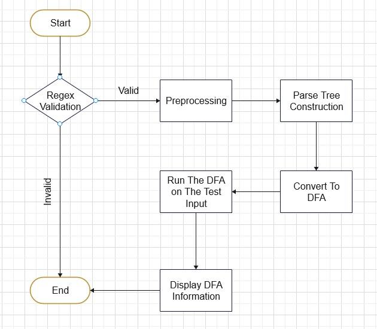
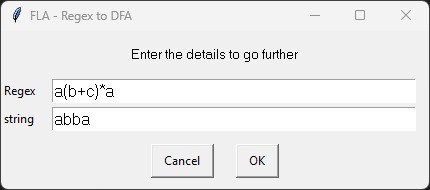
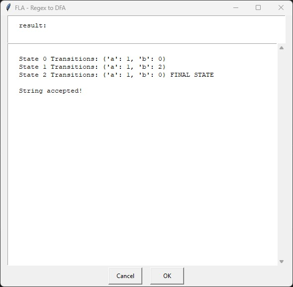

# Regular Expression to DFA Converter

This is a Python codebase for converting a regular expression (regex) into a Deterministic Finite Automaton (DFA). The program allows you to input a regular expression and a string, and it will generate the DFA, validate the string against it, and provide the result.
Prerequisites

Before using the code, ensure you have the following requirements:

    Python 3.x
    Required libraries are installed. You can install them using pip:

    pip install easygui

# Usage

    Clone the repository:

    sh

git clone https://github.com/your-username/regex-to-dfa.git

Navigate to the project directory:

sh

cd regex-to-dfa

Run the program:

sh

    python main.py

    The program will prompt you to enter the regular expression and a string. Enter the details and click OK.

    The program will display the regular expression, alphabet, and the generated DFA.

    It will also test the provided string against the DFA and display the result.

# Code Structure

    main.py: The main program file that handles user input and orchestrates the conversion process.
    utils.py: Contains classes for building the RegexTree, creating the DFA, and running input strings on the DFA.
    regex_validation.py: Validation functions for checking the correctness of the regular expression.
    preprocessing.py: Preprocessing functions for cleaning up the regular expression.
    Program Flow can be viewed in program_flow.png 

# Configuration

You can configure the regular expression and other options within the codebase. Modify the regex variable in the main.py file to set your desired regular expression.

# Example

Sample input and output can be viewed in input.png and output.png respectively.

# Contributing

Contributions are welcome! If you find any issues or have suggestions for improvements, feel free to open an issue or submit a pull request.

# Acknowledgments

The Encryption and Decryption Manager was developed using the easygui library for creating the graphical user interface.
